<svg xmlns="http://www.w3.org/2000/svg" width="850" height="320" viewBox="0 0 850 320">
  <defs>
    <radialGradient id="glowA" cx="30%" cy="35%" r="45%">
      <stop offset="0%" stop-color="#8b3dff" stop-opacity="0.75"/>
      <stop offset="100%" stop-color="#8b3dff" stop-opacity="0"/>
    </radialGradient>
    <radialGradient id="glowB" cx="75%" cy="40%" r="40%">
      <stop offset="0%" stop-color="#ff3d9a" stop-opacity="0.55"/>
      <stop offset="100%" stop-color="#ff3d9a" stop-opacity="0"/>
    </radialGradient>
    <radialGradient id="glowC" cx="55%" cy="80%" r="35%">
      <stop offset="0%" stop-color="#3d7bff" stop-opacity="0.35"/>
      <stop offset="100%" stop-color="#3d7bff" stop-opacity="0"/>
    </radialGradient>
    <filter id="blur"><feGaussianBlur stdDeviation="2"/></filter>
    <filter id="textGlow" x="-20%" y="-50%" width="140%" height="200%">
      <feGaussianBlur stdDeviation="6" result="b"/>
      <feMerge><feMergeNode in="b"/><feMergeNode in="SourceGraphic"/></feMerge>
    </filter>
    
  </defs>

  <rect class="bg" width="850" height="320" rx="14"/>
  <rect class="pulse" width="850" height="320" rx="14" fill="url(#glowA)"/>
  <rect class="pulse2" width="850" height="320" rx="14" fill="url(#glowB)"/>
  <rect width="850" height="320" rx="14" fill="url(#glowC)"/>

  <!-- stars -->
  <circle class="star" cx="120" cy="60" r="1.2"/>
  <circle class="star s2" cx="730" cy="80" r="1"/>
  <circle class="star s3" cx="640" cy="250" r="1.3"/>
  <circle class="star s2" cx="200" cy="240" r="0.9"/>
  <circle class="star" cx="780" cy="200" r="1"/>
  <circle class="star s3" cx="60" cy="170" r="0.8"/>

  <!-- corner brackets -->
  <path class="corner" d="M24 48 V24 H48"/>
  <path class="corner" d="M826 48 V24 H802"/>
  <path class="corner" d="M24 272 V296 H48"/>
  <path class="corner" d="M826 272 V296 H802"/>

  <text x="436" y="120" text-anchor="middle" class="title fade" filter="url(#textGlow)">TIANA</text>
  <text x="425" y="155" text-anchor="middle" class="role fade d1">WEB DEVELOPER</text>
  <text x="425" y="200" text-anchor="middle" class="sub fade d2">FULL-STACK  |  UI/UX DESIGN</text>
  <text x="425" y="222" text-anchor="middle" class="tags fade d2">REACT · NEXT.JS · SUPABASE · LARAVEL · VERCEL</text>
  <text x="425" y="255" text-anchor="middle" class="url fade d3">[ github.com/ianastar30 ]</text>
</svg>

  

  

  
  
  
  
  
  
  
  

 

<!-- STATS (stars · commits · PRs · repos) -->

  
  

<!-- STACK ANALYTICS -->
<h3 align="left"><code>▍STACK ANALYTICS</code></h3>

  

<!-- ACTIVITY PULSE -->
<h3 align="left"><code>▍ACTIVITY PULSE</code></h3>

  

<!-- PRIMARY DEPLOYMENTS — swap in your own repo names -->
<h3 align="left"><code>▍PRIMARY DEPLOYMENTS</code></h3>

  
  
  

 

  

<svg xmlns="http://www.w3.org/2000/svg" width="850" height="60" viewBox="0 0 850 60">
  <defs>
    <linearGradient id="line" x1="0" x2="1">
      <stop offset="0%" stop-color="#8b3dff" stop-opacity="0"/>
      <stop offset="50%" stop-color="#ff3d9a"/>
      <stop offset="100%" stop-color="#8b3dff" stop-opacity="0"/>
    </linearGradient>
  </defs>
  <rect width="850" height="60" rx="10" fill="#07070d"/>
  <rect x="125" y="14" width="600" height="1" fill="url(#line)"/>
  <text x="425" y="40" text-anchor="middle"
        style="font: 600 10px 'Segoe UI', Helvetica, Arial, sans-serif; letter-spacing: 5px; fill: #5c5775;">
    TIANA · BUILDING FAST, CLEAN, HUMAN-FRIENDLY WEB
  </text>
</svg>

