  

<picture>
  <source media="(prefers-color-scheme: dark)" srcset="./assets/header-dark.svg" />
  <source media="(prefers-color-scheme: light)" srcset="./assets/header-light.svg" />
  
</picture>

  

  <picture>
    <source media="(prefers-color-scheme: dark)" srcset="https://skillicons.dev/icons?i=html,css,js,react,nextjs,supabase,laravel,php,mysql,vercel,figma&theme=dark" />
    <source media="(prefers-color-scheme: light)" srcset="https://skillicons.dev/icons?i=html,css,js,react,nextjs,supabase,laravel,php,mysql,vercel,figma&theme=light" />
    
  </picture>

 

  <picture>
    <source media="(prefers-color-scheme: dark)" srcset="https://github-readme-stats.vercel.app/api?username=ianastar30&show_icons=true&hide_border=true&bg_color=07070d&title_color=b18cff&icon_color=ff6fb1&text_color=d6d0e8&ring_color=8b3dff&include_all_commits=true&count_private=true&rank_icon=github" />
    <source media="(prefers-color-scheme: light)" srcset="https://github-readme-stats.vercel.app/api?username=ianastar30&show_icons=true&hide_border=true&bg_color=fbf9ff&title_color=7c3aed&icon_color=db2777&text_color=1f1a2e&ring_color=7c3aed&include_all_commits=true&count_private=true&rank_icon=github" />
    
  </picture>
  <picture>
    <source media="(prefers-color-scheme: dark)" srcset="https://github-readme-streak-stats.herokuapp.com/?user=ianastar30&hide_border=true&background=07070d&ring=8b3dff&fire=ff6fb1&currStreakLabel=b18cff&sideLabels=b18cff&currStreakNum=ffffff&sideNums=ffffff&dates=5c5775&stroke=2a2540" />
    <source media="(prefers-color-scheme: light)" srcset="https://github-readme-streak-stats.herokuapp.com/?user=ianastar30&hide_border=true&background=fbf9ff&ring=7c3aed&fire=db2777&currStreakLabel=7c3aed&sideLabels=7c3aed&currStreakNum=1f1a2e&sideNums=1f1a2e&dates=8a84a3&stroke=e4dcf7" />
    
  </picture>

<picture>
  <source media="(prefers-color-scheme: dark)" srcset="./assets/title-stack-dark.svg" />
  <source media="(prefers-color-scheme: light)" srcset="./assets/title-stack-light.svg" />
  
</picture>

  <picture>
    <source media="(prefers-color-scheme: dark)" srcset="https://github-readme-stats.vercel.app/api/top-langs/?username=ianastar30&layout=compact&langs_count=10&hide_border=true&hide_title=true&card_width=850&bg_color=07070d&text_color=d6d0e8" />
    <source media="(prefers-color-scheme: light)" srcset="https://github-readme-stats.vercel.app/api/top-langs/?username=ianastar30&layout=compact&langs_count=10&hide_border=true&hide_title=true&card_width=850&bg_color=fbf9ff&text_color=1f1a2e" />
    
  </picture>

<picture>
  <source media="(prefers-color-scheme: dark)" srcset="./assets/title-activity-dark.svg" />
  <source media="(prefers-color-scheme: light)" srcset="./assets/title-activity-light.svg" />
  
</picture>

  <picture>
    <source media="(prefers-color-scheme: dark)" srcset="https://github-readme-activity-graph.vercel.app/graph?username=ianastar30&bg_color=07070d&color=d6d0e8&line=ff6fb1&point=b18cff&area=true&area_color=8b3dff&hide_border=true&custom_title=%20" />
    <source media="(prefers-color-scheme: light)" srcset="https://github-readme-activity-graph.vercel.app/graph?username=ianastar30&bg_color=fbf9ff&color=1f1a2e&line=db2777&point=7c3aed&area=true&area_color=a78bfa&hide_border=true&custom_title=%20" />
    
  </picture>

<!--
PRIMARY DEPLOYMENTS — hidden until you have public repos to show.
To turn it on: delete this comment's first and last lines, and replace REPO_1 / REPO_2 / REPO_3 with your repo names.

<picture>
  <source media="(prefers-color-scheme: dark)" srcset="./assets/title-projects-dark.svg" />
  <source media="(prefers-color-scheme: light)" srcset="./assets/title-projects-light.svg" />
  
</picture>

  
  
  

-->

 

<picture>
  <source media="(prefers-color-scheme: dark)" srcset="./assets/footer-dark.svg" />
  <source media="(prefers-color-scheme: light)" srcset="./assets/footer-light.svg" />
  
</picture>
